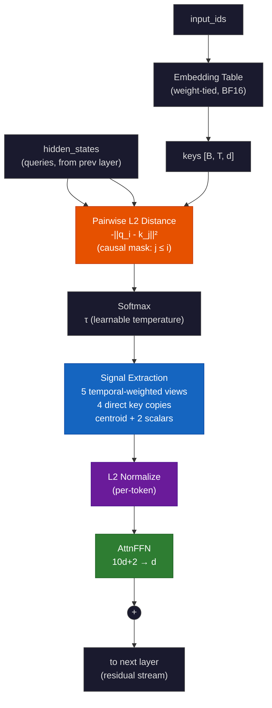

# RayTention — Zero-KV-Cache Attention via Geometric Signal Extraction

---

## The Problem: The KV Cache Explosion

Every transformer language model stores every key and value for every token it has ever seen. This is the **KV cache** — and it grows without bound.

Generate 1,000 tokens? Fine. Generate 1,000,000 tokens? That KV cache now consumes gigabytes of VRAM — per request. For a production model (d_model=4096, 32 layers, bf16) at 1M context, the KV cache alone eats **~524 GB** with standard multi-head attention. Even with grouped-query attention (GQA-8, like Llama 3), it's still **~122 GB** — and it grows with every token.

Your GPU can't fit one request, let alone serve hundreds of users.

Every major effort to fix this — grouped-query attention (GQA), multi-head latent attention (MLA), sliding windows, sparse attention — only shrinks the constant factor. The KV cache is still $O(T)$. It still grows.

| Mechanism | 1K ctx | 16K ctx | 65K ctx | 131K ctx | 262K ctx | 1M ctx |
|---|---|---|---|---|---|---|
| **MHA** (32 KV heads) | 0.5 GB | 8.6 GB | 34 GB | 69 GB | 137 GB | 524 GB |
| **Flash Attention** | 0.5 GB | 8.6 GB | 34 GB | 69 GB | 137 GB | 524 GB |
| **GQA-8** (Llama 3) | 0.1 GB | 2.1 GB | 8.6 GB | 17 GB | 34 GB | 131 GB |
| **GQA-4** | 0.07 GB | 1.1 GB | 4.3 GB | 8.6 GB | 17 GB | 66 GB |
| **MQA** (1 KV head) | 0.02 GB | 0.3 GB | 1.1 GB | 2.1 GB | 4.3 GB | 16 GB |
| **MLA** (DeepSeek V2, latent=576) | 0.08 GB | 1.2 GB | 4.8 GB | 9.7 GB | 19 GB | 74 GB |
| **Sliding Window** (Mistral, W=4K) | 0.5 GB | 0.5 GB | 0.5 GB | 0.5 GB | 0.5 GB | 0.5 GB |
| **RayTention** | **0** | **0** | **0** | **0** | **0** | **0** |

- **Flash Attention** — fused kernel, same math as MHA, same KV cache. Improves speed, not memory.
- **Sliding Window** — $O(1)$ memory (capped at window size) but loses access to tokens outside the window. Mistral uses 4K with GQA-8; the table shows standard MHA with W=4K for comparison.


**RayTention eliminates the KV cache entirely.** It's $O(1)$.

---

## The Core Insight: Attention Is Geometric

What does attention actually do? It asks: "which previous tokens are relevant to the current one?"

A dot product $q \cdot k$ measures relevance by projection — how much of key $k$ lies along query $q$. It's an algebraic operation, not a geometric one. It happens to work, but it has no natural interpretation as "proximity in meaning space."

**Euclidean distance does.** If two tokens mean similar things, their embeddings should be close together. A small $L_2$ distance directly means "these tokens are near each other in the space of meaning." That's what attention is trying to figure out.

RayTention replaces:

$$\text{score}_{\text{standard}} = \frac{q \cdot k}{\sqrt{d}} \qquad \text{with} \qquad \text{score}_{\text{raytention}} = -\|q - k\|^2_2$$

Closer = higher score. Further = lower score. That's the whole scoring rule.

---

## What RayTention Does

Standard attention produces one thing per token: a weighted average of value vectors, which gets fed to the next layer. The keys and values for every past token must be kept around because the next token will need to attend over them again.

RayTention produces a **fixed-size structured summary** instead. For every token, it extracts 10 different "views" of the attention distribution — each one capturing a different aspect of what the model is paying attention to — plus 2 global statistics about the shape of that attention:

| Channel | What it captures | Why it matters |
|---|---|---|
| **Centroid** | Softmax-weighted average of all context keys | The standard "what am I attending to?" — matches ordinary attention |
| **Primacy** | Same, but heavily weighted toward early tokens | "What was established at the start?" |
| **Sharp / Moderate / Slow Temporal** | Weighted toward recent context at three different decay rates | "What just happened?", "What's been developing?", "What's the long arc?" |
| **Predecessor** | The immediately previous token's key | "What came right before me?" — crucial for local syntax |
| **Top-1 / Top-2 Keys** | The two keys with highest attention weight | "What am I most focused on, specifically?" — raw embeddings, not blends |
| **Recency** | Very recent context (fast decay) | "What's the immediate context?" |
| **Antitop** | The key with the *least* attention (but not zero) | "What am I deliberately ignoring?" — provides contrast |
| **Spread** | Weighted average $L_2$ distance across all attended keys | "How tight or loose is my focus?" — a single number |
| **Entropy** | Shannon entropy of the softmax distribution | "Am I confident (peaked) or uncertain (flat)?" |

All 12 channels together form a vector of **$10d + 2$ floats** — a fixed size regardless of context length. For $d=768$, that's 7,682 floats (~30 KB). At 1M tokens, standard attention's KV cache for the same model would be ~4 GB.

**The key idea:** you don't need to re-read the entire history every time you generate a token. You need a rich enough summary of what the history *means*. These 12 channels are that summary.

---

## How It Works, Step by Step



For each token being processed:

### Step 1 — Score every past token by geometric proximity

```
For each past token j (up to and including the current one):
    score[j] = -||query - key[j]||²
```

Keys are just the embedding table entries for each token — no separate key projection. This is a dense $O(T^2)$ computation, same asymptotic cost as standard attention, but the result is used differently.

### Step 2 — Convert to attention weights (softmax)

```
w[j] = exp(score[j] / τ) / Σ_k exp(score[k] / τ)
```

Temperature $\tau$ is learnable. It starts at 1.0 and can be annealed during training to sharpen attention.

### Step 3 — Extract the 12 signals

Five temporally-weighted variants apply exponential decay masks $\gamma^{\text{position}}$ to the softmax weights before computing weighted averages of keys. Different $\gamma$ values (0.99, 0.5, 0.88, 0.993, 0.3) produce different timescale emphases. The top-1, top-2, predecessor, and antitop channels copy raw key vectors directly. Spread and entropy are scalars computed from the weights.

### Step 4 — Normalize and output

The entire $10d+2$ signal vector is $L_2$-normalized per token. This goes to a small feedforward network (AttnFFN) that projects it back to $d$ dimensions for the residual stream — exactly like the output projection in standard attention.

```
Query ──→ L2 distances ──→ softmax ──→ 12 signals ──→ AttnFFN ──→ +
                                                                     |
Embedding table (keys) ──────────────────────────────────────────────┘
```

**Crucially:** after computing the signals, the keys are *discarded*. There is nothing to store for future tokens. The next token will compute its own signals from scratch, looking at the embedding table and the attention weights for *its* query. The signal vector itself — not the raw keys — is what propagates forward.

---

## Why RayTention Exists

The KV cache is not a feature of attention. It's an **architectural side effect**.

Standard attention was designed when context windows were 512 tokens and the KV cache was measured in kilobytes. Nobody designed it to scale to millions of tokens — it just happened to be a byproduct of how attention computes its output, and now everyone treats it as inevitable.

RayTention proves it's not. You can have attention without a cache. The price is computing $O(T^2)$ distances per token (same as standard attention's scoring step), but the payoff is eliminating the $O(T)$ memory that accumulates across tokens. For inference, memory matters more than FLOPs.

### When does this matter?

- **Long-form generation** (code, stories, documents): the KV cache grows with every token you emit
- **Multi-turn conversations**: the entire history sits in VRAM for the duration
- **Multi-tenant serving**: every concurrent user has their own KV cache; with RayTention, they'd share only model weights
- **Edge devices**: phones and laptops can't fit million-token KV caches; they can fit $10d+2$ floats

---

## Quick Start

```bash
pip install torch
```

```python
import torch
from reference_raytention import RayTention

# Works with any model dimension
rt = RayTention(d_model=256)
embed = torch.nn.Embedding(vocab_size=10000, embedding_dim=256)

input_ids = torch.randint(0, 10000, (2, 64))        # [batch=2, seq=64]
hidden = embed(input_ids)

signals = rt(hidden, embed.weight, input_ids)         # [2, 64, 2562]
# L2 norm per token is exactly 1.0
```

Run the built-in test:

```bash
python3 reference_raytention.py
# Input:  torch.Size([2, 64, 256])
# Output: torch.Size([2, 64, 2562])
# L2 norm per token: 1.0000 ✓
```

### Integration Recipes

**Replace standard self-attention in a transformer block:**

```python
class TransformerBlock(nn.Module):
    def __init__(self, d_model):
        super().__init__()
        self.rt = RayTention(d_model=d_model)
        self.proj = nn.Linear(10 * d_model + 2, d_model)  # signals → residual
        self.ffn = nn.Sequential(
            nn.Linear(d_model, 4 * d_model), nn.GELU(),
            nn.Linear(4 * d_model, d_model))
        self.norm1 = nn.RMSNorm(d_model)
        self.norm2 = nn.RMSNorm(d_model)

    def forward(self, x, emb_w, ids):
        s = self.rt(self.norm1(x), emb_w, ids)
        x = x + self.proj(s)
        x = x + self.ffn(self.norm2(x))
        return x
```

**Use signals to drive an MoE router:**

```python
class MoEBlock(nn.Module):
    def __init__(self, d_model, n_experts):
        super().__init__()
        self.rt = RayTention(d_model=d_model)
        # Router sees both the signal summary AND the raw hidden state
        self.router = nn.Linear(10 * d_model + 2 + d_model, n_experts)

    def forward(self, x, emb_w, ids):
        s = self.rt(x, emb_w, ids)
        logits = self.router(torch.cat([s, x], dim=-1))
        # ... top-k gating, expert dispatch ...
```

**Anneal temperature during training:**

```python
rt.tau.data.fill_(1.0 / (1.0 + step / 5000.0))
```

---

## Architecture

```
Input → RMSNorm → L2 distances → 12 Signals → AttnFFN → + → RMSNorm → FFN → + → Output
        ↑                                                                         |
        └──────────────── Token Embeddings (weight-tied, no KV projections) ──────┘
```

- **Weight-tied embeddings**: The embedding table serves as both input embeddings and attention keys. No separate $W_K$, $W_V$ projections.
- **AttnFFN**: A small 2-layer MLP mapping $10d+2 \to d$. This replaces the output projection in standard attention.
- **No KV cache**: Signals are computed per token, used once, and discarded. Nothing accumulates.

---

## Comparison to Standard Attention

| | Standard Transformer | RayTention |
|---|---|---|
| **Scoring** | $q \cdot k$ (projection) | $-\|q - k\|^2$ (proximity) |
| **Output** | 1 weighted-average vector | 10 structured vectors + 2 scalars |
| **Key storage** | $W_K, W_V$ per layer | Embedding table (shared) |
| **Inference memory** | $O(T)$ — KV cache grows | $O(1)$ — fixed signal vector |
| **Training memory** | $O(T^2)$ attention matrix | $O(T^2)$ score matrix (chunked → $O(T \cdot C)$) |
| **What flows forward** | Attended values + residual | Signal summary + residual |
| **Interpretability** | Attention weights only | Centroid, spread, entropy, top-k keys |
| **Multi-tenant cost** | Per-user KV cache × $T$ | Per-user signal vector (fixed) |

---

## Training Memory: The Honest Picture

During training, both standard attention and RayTention materialize a $T \times T$ matrix:

- **Standard attention**: the attention weight matrix ($QK^\top$)
- **RayTention**: the pairwise distance matrix ($\|q_i - k_j\|^2$)

Without batching or chunking, this is $O(T^2)$ VRAM in both cases. At $T{=}2048$ with $d{=}768$ and batch 8, that's ~134 MB for the score matrix alone — manageable. At $T{=}32768$, it's ~34 GB — not.

RayTention's **chunked streaming** mode (see [paper](RayTention_Paper.md#2-chunked-streaming)) solves this:

```
for each chunk of 2048 keys:
    compute scores[all_queries, this_chunk]   ← only 2048 columns at a time
    accum_chunk(accumulator, scores)           ← merge into running state
signals = accum_finalize(accumulator)          ← extract 12 channels
```

This reduces training memory from $O(T^2)$ to $O(T \cdot C)$ where $C$ is the chunk size (default 2048). Same trick as FlashAttention's tiling — but applied to signal accumulation instead of softmax rescaling.

**The key distinction:**

| | Standard Attention | RayTention |
|---|---|---|
| **Training forward pass** | $O(T^2)$ attention matrix | $O(T \cdot C)$ with chunking |
| **Training backward pass** | $O(T^2)$ gradients | $O(T \cdot C)$ with chunking |
| **Inference per new token** | Must re-read $O(T)$ KV cache | Computes signals from scratch ($O(T)$) but stores nothing |
| **Inference total memory** | $O(T)$ KV cache accumulates | $O(1)$ — signals replace the cache |

RayTention doesn't eliminate the $O(T^2)$ compute — nothing can, because every token must compare against every past token. What it eliminates is the $O(T)$ *accumulation* of state across tokens during inference.

---

## Benchmarks

Measured on RTX 5080 (16.6 GB), CUDA 13.3, Rust + cuBLAS. See [RayTention_Paper.md](RayTention_Paper.md) for kernel-level details.

### Model Config (current CUDA implementation)

| Parameter | Value |
|---|---|
| Layers | 4 |
| d_model | 768 |
| FFN hidden | 3,072 |
| Vocab | 49,152 |
| Params | ~268.5M |
| Embedding table | 75 MB (BF16, L2-cache resident) |
| Signal dimension | 7,682 floats (~30 KB) per token |
| Score matrix (T=2048, B=8) | ~134 MB fp32 (1 chunk at C=2048; $O(T \cdot C)$ with chunking for longer sequences) |

> Training throughput benchmarks are in progress. The chunked streaming kernels are implemented and functional; stable throughput numbers will be published once the current training run completes.

---

## Where RayTention Wins

| Scenario | Why |
|---|---|
| **Long-context inference** | Memory is $O(1)$, not $O(T)$. Generate indefinitely. |
| **Multi-tenant serving** | Every user shares model weights; only a signal vector per request |
| **Edge deployment** | Fits where KV cache would exceed device RAM |
| **Retrieval / RAG** | Compute signals once per document, reuse for all queries |
| **Interpretability** | Spread and entropy tell you how the model is thinking |
| **Simplicity** | 2–3 kernel types vs dozens for fused standard attention |

## Where Standard Wins

| Scenario | Why |
|---|---|
| **Short contexts (< 1K)** | KV cache is tiny; FlashAttention is extremely optimized |
| **Training throughput** | cuBLAS + FlashAttention have decades of person-years invested |
| **Ecosystem** | Every framework, every serving stack, every quantization tool supports it |

---

## Files

| File | Purpose |
|---|---|
| `reference_raytention.py` | Pure PyTorch reference — runs on CPU, matches CUDA kernels exactly |
| `RayTention_Paper.md` | Full technical paper: CUDA kernels, chunked streaming, OptiX backend, backward pass |
| `LICENSE` | AGPL-3.0 |
| `README.md` | This file |

---

## Future Work

- **RT Core scoring** — $L_2$ distance maps directly to ray tracing hardware. NVIDIA RT cores could compute pairwise distances for thousands of keys in parallel with zero CUDA core utilization.
- **Incremental signals** — Update centroid, spread, and top-k in $O(1)$ per new token instead of recomputing from scratch.
- **Signal reuse across layers** — Compute signals once at the bottom, feed to all higher layers.
- **Scaling laws** — Quality at $d = 512, 768, 4096, 8192$; how many signals are needed as dimension grows?
- **Native inference binary** — Fuse scoring + signal extraction into a single CUDA kernel with no Python overhead.

---

## Citation

```bibtex
@software{raytention2026,
  title     = {RayTention: Zero-KV-Cache Attention via Geometric Signal Extraction},
  author    = {NohWai Software},
  year      = {2026},
  url       = {https://github.com/NohWai-Software/RayTention}
}
```

## License

AGPL-3.0 — see [LICENSE](LICENSE)

---

*Patent Pending — U.S. Patent Application No. 64/102,801. All rights reserved by NohWai Software.*

